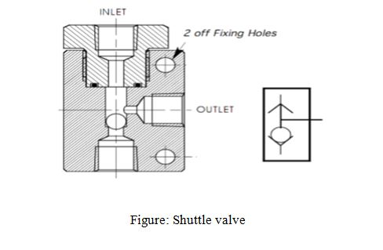
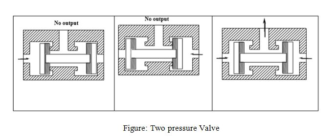
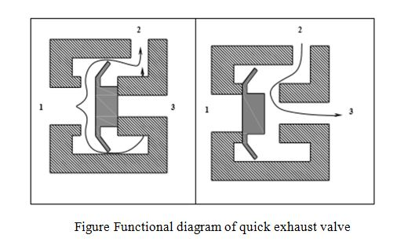
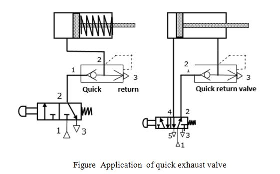
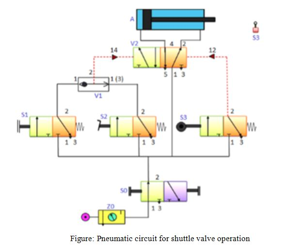

## Shuttle valve:
It is also known as a double control valve or double check valve. A shuttle valve has two inlets and one outlet. At any one time, flow is shut off in the direction of whichever inlet is unloaded and is open from the loaded inlet to the outlet (Figure 1.36). A shuttle valve may be installed, for example, when a power unit (cylinder) or control unit (valve) is to be actuated from two points, which may be remote from one other.

## Two Pressure Valve:
This valve is the pneumatic AND valve. It is also derivate of Non Return Valve. A two pressure valve requires two pressurised inputs to allow an output from itself. The cross sectional views of two pressure valve in two positions are given in Figure 1.40 As shown in the figure, this valve has two inputs 12 and 14 and one output 2. If the compressed air is applied to either 12 or input 14, the spool moves to block the flow, and no signal appears at output 2. If signals are applied to both the inputs 12 and 14, the compressed air flows through the valve, and the signal appears at output 2.

## Quick Exhaust Valves:
A quick exhaust valve is a typical shuttle valve. The quick exhaust valve is used to exhaust the cylinder air quickly to atmosphere. Schematic diagram of quick exhaust valve is shown in Figure 1.38. In many applications especially with single acting cylinders, it is a common practice to increase the piston speed during retraction of the cylinder to save the cycle time. The higher speed of the piston is possible by reducing the resistance to flow of the exhausting air during the motion of cylinder. The resistance can be reduced by expelling the exhausting air to the atmosphere quickly by using Quick exhaust valve.

Forward Motion: During forward movement of piston, compressed air is directly admitted behind the piston through ports 1 and 2 Port 3 is closed due to the supply pressure acting on the diaphragm. Port 3 is usually provided with a silencer to minimise the noise due to exhaust.

Return Motion: During return movement of piston, exhaust air from cylinder is directly exhausted to atmosphere through opening 3 (usually larger and fitted with silencer) .Port 2 is sealed by the diaphragm. Thus exhaust air is not required to pass through long and narrow passages in the working line and final control valve

The construction and operation of a quick exhaust valve is shown in Figure 1.38. It consist of a movable disc (also called flexible ring) and three ports namely, Supply port 1, which is connected to the output of the final control element (Directional control valve). The Output port, 2 of this valve is directly fitted on to the working port of cylinder. The exhaust port, 3 is left open to the atmosphere

Consider a simple operation where a double-acting cylinder is used to transfer parts from a magazine. The cylinder is to be advanced either by operating a push button or by a foot pedal. Once the cylinder is fully advanced, it is to be retracted to its initial position. A 3/2-way roller lever valve is to be used to detect the full extension of the cylinder. Design a pneumatic circuit for the above-mentioned application.

Figure 6.6.1 shows the proposed circuit diagram. As the problem stated, upon actuation of either the push button of valve (S1) or the foot pedal valve (S2), a signal is generated at 1 or 1(3) side of the shuttle valve. The OR condition is met and the signal is passed to the control port 14 of the direction control valve (V2). Due to this signal, the left position of V2 is actuated and the flow of air starts. Pressure is applied on the piston side of the cylinder (A) and the cylinder extends. If the push button or pedal valve is released, the signal at the direction control valve (V2) port is reset. Since DCV (V2) is a double pilot valve, it has a memory function which doesn't allow switching of positions. As the piston reaches the rod end position, the roller valve (S3) is actuated and a signal is applied to port 12 of the DCV (V2). This causes actuation of right side of DCV (V2). Due to this actuation, the flow enters at the rod end side of the cylinder, which pushes the piston towards left and thus the cylinder retracts.

